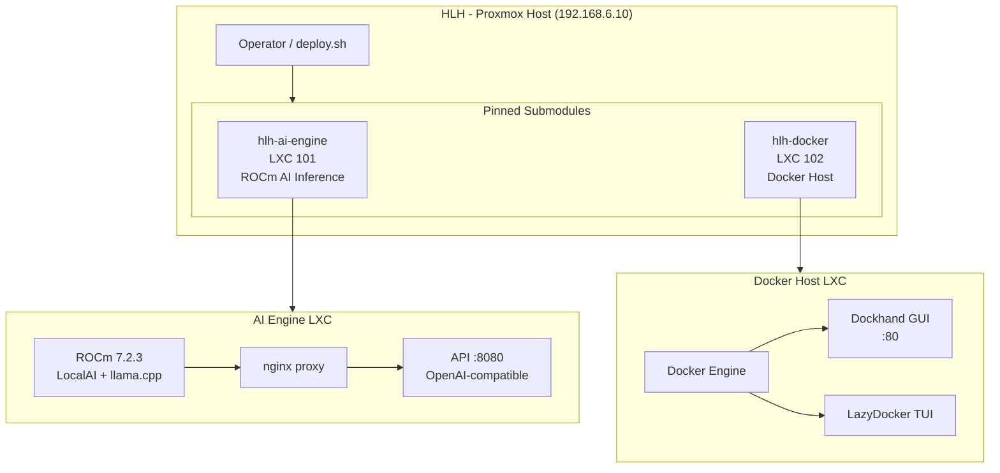

# iac-hlh

Infrastructure-as-Code orchestrator for the HLH (Home Lab Hardware) Proxmox host.

## Executive Summary

`iac-hlh` is the **control repository** for HLH (192.168.6.10). It orchestrates
deterministic deployments of infrastructure components via pinned git submodules.

- Proxmox host: 192.168.6.10 (prox01)
- Storage: Raid0-2TB + RaidZ1-6TB ZFS pools
- Components: hlh-ai-engine (AI inference LXC), hlh-docker (Docker container host)

## Architecture Overview



## Repository Boundary

**Owns:**
- Proxmox host bootstrap (ZFS storage, GPU driver binding)
- Orchestration of component submodules (hlh-ai-engine, hlh-docker)
- Ansible roles for Docker host provisioning
- Service stacks (openspeedtest, uptime-kuma)
- Documentation (architecture, contracts, migration plans)

**Does not own:**
- Component LXC internals (that's each submodule repo)
- Application business logic (TrashPanda, BrickCipher, VoxChimera)

## Quick Start

Run the full deployment pipeline:

```bash
./deploy.sh
```

## Deployment Pipeline

```
[1/5] Initialize pinned submodules
[2/5] Run host bootstrap (ZFS storage)
[3/5] Deploy hlh-ai-engine
[4/5] Deploy hlh-docker
[5/5] Complete
```

## Governance

- All component versions are pinned via git submodules
- `deploy.sh` syncs and initializes submodules before deployment
- Component repos are independent and versioned separately
- See `docs/architecture.md` for the full layered architecture

## Key Artifacts

| Artifact | Purpose |
|----------|---------|
| `deploy.sh` | 5-stage orchestration entrypoint |
| `bootstrap/zfsbootstrap.sh` | ZFS pool creation for host |
| `roles/docker_host/` | Ansible role for Docker host |
| `services/` | Docker Compose service stacks |
| `docs/` | Architecture, contracts, migration plans |
